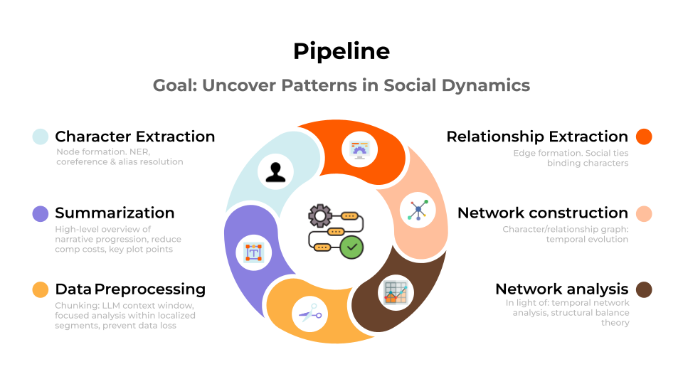
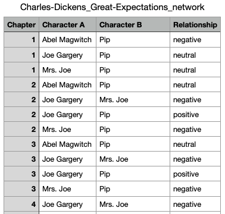
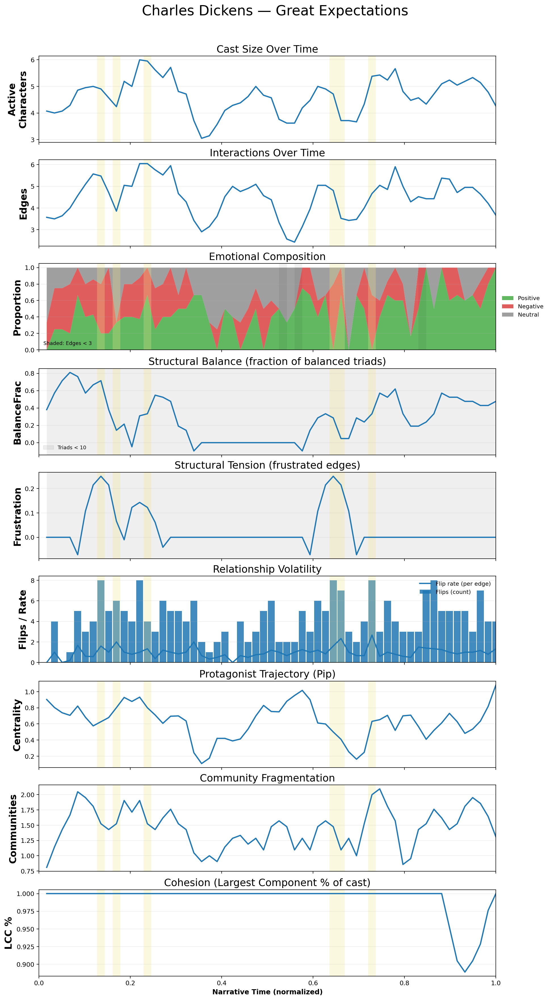
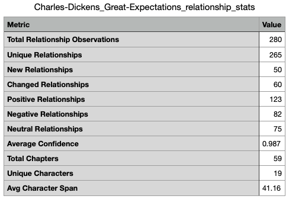
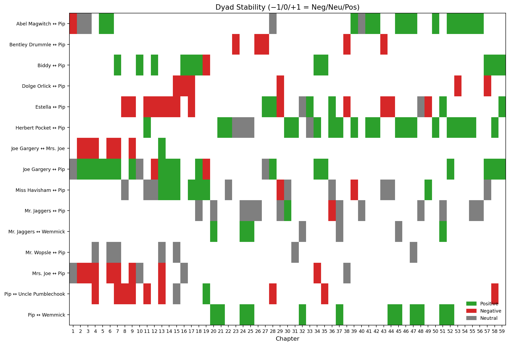

<p align="center"> 

   

</p> 

  

<h1 align="center">CharDyNet: Temporal Character Networks and Social Dynamics in Literary Texts</h1> 

  

<p align="center"> 

  <div align="center">
    <a href="https://raw.githubusercontent.com/L-Earthling/CharDyNet/refs/heads/main/dataset/CharDyNet_Sparknotes_all_networks.csv">
      
    </a>
  </div> 

</p> 

  

--- 

  

## Table of Contents 

| [TL;DR](#-tldr) | [Features](#-features) | [Pipeline](#-pipeline-overview) | [Description](#-description) | [Installation](#-installation) | 

  

--- 

  

## 🧭 TL;DR 

**CharDyNet** transforms literary texts into evolving social graphs.   

It combines **LLMs**, **temporal network analysis**, and **structural balance theory** to study how alliances, conflicts, and communities evolve through narrative time.   

Explore the **CharDyNet-SN sandbox** to see analysis and chapter-by-chapter visualisations for 600+ web-scraped-based networks. 

  

<p align="center"> 

   

</p> 

  

--- 

  

## ✨ Features 

- **End-to-end pipeline** – from raw or summarised text to temporal, signed graphs 

- **LLM-based relationship extraction** – identifies characters and assigns tie polarity (+ / – / 0) 

- **Temporal updates** – tracks evolving edges, sign flips, and network volatility 

- **Structural balance analysis** – computes balanced/unbalanced triads, frustration, tension 

- **Network metrics** – density, centrality, cohesion, community fragmentation, protagonist trajectory 

- **Corpus-level aggregation** – genre-, author-, and period-level comparisons 

- **Visual outputs** – multi-panel per-book time series and animated GIFs 

- **Reproducible setup** – consistent seeds, metadata manifests, and modular Python scripts 

  

--- 

  

## 🔬 Pipeline Overview 

1. **Text Segmentation** – parse chapters/partitions (SparkNotes/Gutenberg or custom). 

2. **Character Extraction** – identify entities and unify aliases (e.g., “Aragorn” → “Strider”). 

3. **Relation Extraction** – LLM prompting to classify pairwise relations (positive/negative/neutral). 

4. **Temporal Graph Construction** – per-chapter signed networks; track updates & flips. 

5. **Metric Computation** – density, balance, frustration, flip-rate, etc. 

6. **Visualisation & Export** – temporal multi-panels, protagonist trajectories, GIFs. 

7. **Corpus-Level Analysis** – aggregate by genre/author/epoch; clustering & stats. 

  

--- 

  

## 📊 Example Outputs 

Each processed book includes: 

- `*_network.csv` – extracted signed relationships 

- `*_temporal_metrics_enriched.csv` – per-chapter metrics 

- `*_relationship_stats.csv` – per-book metric stats 

- `*_protagonist_traj.csv` – protagonist centrality trajectory 

- `*_temporal_9panel.png` – per-book visual summary 

- `*_dyad_stability_topK15.png` – stability of key relationships 

  

### Visual Examples 

  

<p align="center"> 

  <br> 

  <em>Animated evolving character network (chapter-by-chapter)</em> 

</p> 


<p align="center"> 

  <br> 

  <em>Static snapshot of a signed character network</em> 

</p> 

  

<p align="center"> 

  <br> 

  <em>Nine-panel temporal summary: balance, density, centralities, and more</em> 

</p> 

  

<p align="center"> 

  <br> 

  <em>Per-book relationship statistics</em> 

</p> 

  

<p align="center"> 

  <br> 

  <em>Top-15 dyad stability across the narrative</em> 

</p> 

  


 

--- 

  

## ⚙️ Installation 

```bash 

# 1) (optional) create env 

python3 -m venv .venv && source .venv/bin/activate 

  

# 2) install requirements 

pip install -r requirements.txt 
